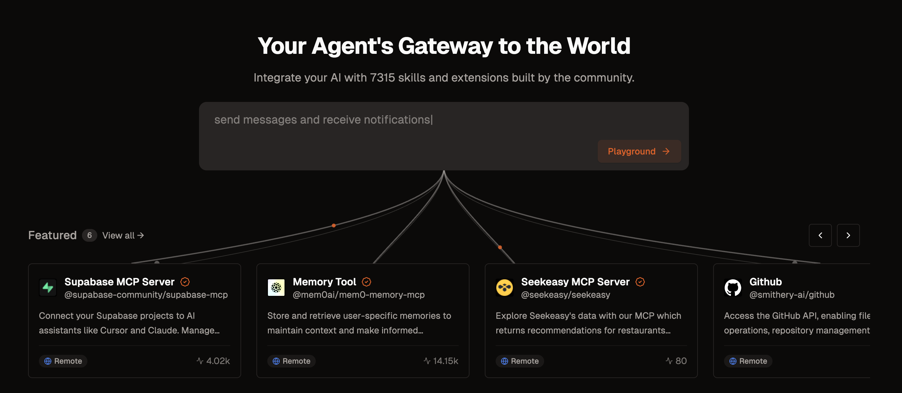

# The problem with tool based memory recall

I wanted to build an LLM assistant with memory abilities. My goal was to make a _program_ that could chat in human text. My ideal users are technical, capable and interested in customizing their software, but not necessarily interested in LLM's for their own sake.

The first solution I turned to, which many people have done, is build an agent loop with access to custom tools I wrote, that manage and read memory:

<diagram: agent with access to create_memory, search_memory>

There's now a handly tool for builders like this: MCP. MCP has taken off among LLM builders, to the point where it almost seems mandatory to support it to get anyone interested in your tool. There are many implementations of my memory tools available via MCP, in fact [smithery.ai](https://smithery.ai/) lists one from Mem0 on it's homepage:

Now, an (in theory) lightweight abstraction sits between my program and it's tools:

<diagram: mcp in between my program and the memory tools>

There are in theory 3 involved parties for MCP's:
1. the MCP author
2. the LLM-powered program creator
3. the end user

There are storm clouds on the horizon, though: the _builders_ of MCP servers that far exceeds the number of _end users_[1].

### Problems with the tool approach

I got my program working pretty well on gpt-4. With careful prompt tweaking, it referenced and created memories at the right times.

Then, I wanted to see how Sonnet would do, and I had a problem[3]: the program's behavior completely changed! Now, it was creating a memory on almost every message, and searching memories for even trivial responses.

### MCP's user problem
When I run a software program, my goal is _automoation_. I want the software to do a task so reliably that I _don't have to think about it_. For a program to fill this need, it must do repeatable tasks _in a consistent way_. If a program's job is not done consistently, I'll still have to think about it, and that's what the computer is for!

How can we accomplish this, when LLM's are by definition open ended and unpredictable?

### Workflows vs Agents

Today, the _agent_ abstraction is so dominant in the field that it has become the standard word for "LLM powered software program". However, I think _workflow_ is a compelling alternative:

<digram: original agent bit, vs a workflow loop>

Many pixels have been spilled debating what constitutes an _agent_. Here's my definition:
- long lived, has autonomy
- has multiple, potentially open ended use cases

The _agent_ has many degrees of freedom with what changes it can make in your system, and it's discretion will be used to determine what data it reads.

A _workflow_ is, navigating a _decision tree_, considering a more defined set of options at each step, and working towards a concrete goal.

These two abstractions are very similar, and can in fact describe the same program. However, the distinction informs important design choices.

An _agent_ generally should have lots of autonomy, with _guardrails_ that prevent it from doing something harmful. A workflow, on the other hand, starts relatively constrained, and perhaps gains more complexity and capabilities over time.

A _workflow_ predominantly leans on the LLM to make _decisions_. At key points, the LLM has the ability to query for data, synthesize it, and choose between a small number of options[4].

Another way to frame the definition of workflows vs agents is how much logic we delegate to code:

<diagram: maximalist approach at one end, increasing "guardrails") (guardrails are just code)

y axi: logic handled by agent
x axies: logic handled by code

top left is fully autonomous LLM
middle is LLM's with guardrails
bottom is workflow

building with workflows is quadratic in how they use code
building with agents in mind is quadratic decining

useful software will land in between here

(anthropic ceo wants to worry you / thrill investors with this scenario)
>

## The issue with MCP and agents: Consistency

One solution to my problem of inconsistent agent tool usage is to edit the tools, but now MCP is in my way: I've completely delegated their logic to a library I don't control!

<diagram: core program can't edit tools across MCP>

Programmers are often faced with the pr their software behaving unpredictably, but luckily they have a handy tool at their disposal: code. However, using it lessens the feel of playing god. As soon as we turn to code to fix our LLM problem, the target market of addressable tasks:

spectrum
-
repeatable, rote                repeatable, but involves simple decisions, quick to validate               complex, new every time
just use code                   Current sweet spot                                      antrhopic's ceo is doing everything in his power to reach this, while also trying to persuade everyone that it will end the world. If it's cumbersome to do but also cumbersome to validate, I'm better off doing the task myself.

the "tools" at the LLM's disposal are, just, _code_. the openai spec implies there will soon be more, but they've tellingly not been able to think of any that aren't well described by the word _function_

What I really want is a script that navigates _decision tree_.

This could also be described as a _workflow_.

An agent might have _guardrails_, constraining it from doing certain operations, but these are largely for _safety_

---

Enter building a memory agent. I built what many people have built: a toolset for reading and managing memories. Once I experimented with different models, a problem quickly emerged: the agent's rate of checking memories was very different between different models. Some called the memory tools too infreuently, and wouldn't recall basic details. Other tools called and created memories for simple things, slowing down their response.

The _agentic_ way to solve this problem would be to add more descriptions to the tools, or nudges to use this tool.

My solution was to partially remove recall and memory creation from the agent's control. Upon receiving a message, the memories are automatically searched, with relevant ones being added to context. Every n messages, a memory is created or the token limit is reached, context messages compressed, and a memory created.

This makes even responding to a message in a personified agent way, a _workflow_. (receive message -> incorporate response -> send response -> wait for message)

---

For a piece of software to be useful, I need it to do something I want it to do, _predictably_. Only when a task is done _predictablly_ does it actually relieve me of having to think about it.

I think software maintainers who think about building "agents"  will be outcompeted by those who think about building _workflows_.

The agent approach leads maintainers to _add more prompting_. This can solve some problems, but in the long run what this will create is either unpredictable abstractions, or a predictable abstraction created at very high cost.

The workflow approach leads to lean on the LLM for relatively simple _decisions_, with shifting complexity to code.

---

[1] A conclusions data-free conclusssion based on vibes and personal experience

[2] :
and not only the _logic_ of the tools, but the _execution on my machine_, and implicity managing my machine's resources (clumsily, at least for now!).

[3] One problem I _didn't_ have, thanks to [litellm](https://www.litellm.ai/), was updating a lot of my code to support a different model API.

[4] This also implies that nearly all of the "tools" at an LLM's disposal are _read only_ - actual execution of system changes is done by code.

